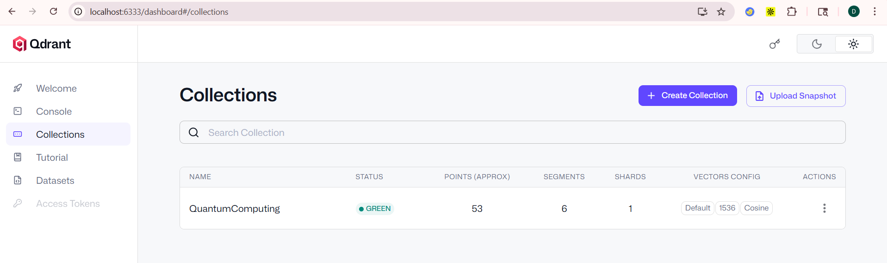
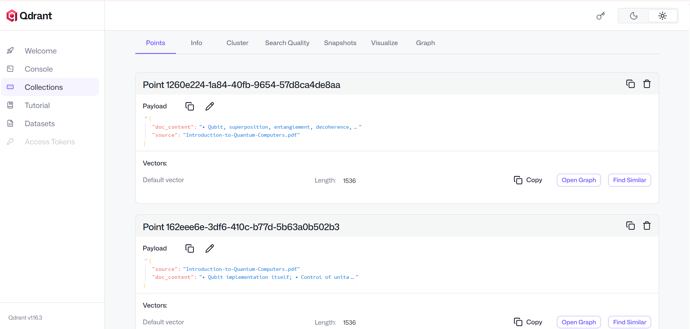

# VectorSearch-Powered RAG Assistant 📚🤖

A compact Retrieval-Augmented Generation (RAG) assistant that combines semantic vector search, PDF document ingestion, and live web search to produce context-aware answers using Spring Boot, Spring AI, Qdrant, and OpenAI.

---

## Table of Contents
1. [Overview](#overview)
2. [Key Features](#key-features)
3. [Tech Stack](#tech-stack)
4. [Quick Start](#quick-start)
5. [Configuration](#configuration)
6. [Document Ingestion Flow](#document-ingestion-flow)
7. [Project Structure](#project-structure)
8. [Development Tips](#development-tips)
9. [Contributing](#contributing)
10. [License & Contact](#license--contact)

---

## Overview
A Document Intelligence System that retrieves the most relevant information from indexed PDFs and live web search results, then generates precise answers via an LLM using a RAG + vector store pipeline.

---

## Key Features ✨
- 🔍 Semantic Vector Search (Qdrant)
- 📄 PDF ingestion & chunking (Apache Tika)
- 🌐 Web search augmentation (Tavily Search API)
- 🧠 Chat memory (JDBC-backed persistence)
- ⚡ Spring AI ChatClient with modular advisors (logging, memory, RAG, token audit)
- 🐳 Easy local Qdrant setup via Docker Compose

---

## Tech Stack 🛠️
- Java 21
- Spring Boot 3.x
- Spring AI
- OpenAI API
- Qdrant (vector DB)
- Apache Tika
- H2 Database
- Docker & Docker Compose

---

## Quick Start ▶️
Prerequisites:
- Docker & Docker Compose
- Java 21
- Maven
- Set environment variables for APIs (see Configuration)

Run locally:
1. Start Qdrant:
   ```bash
   docker compose up -d
   ```
2. Start the application:
   ```bash
   mvn spring-boot:run
   ```
3. Open the UIs:
   - Swagger: `http://localhost:8080/swagger-ui/index.html`
   - H2 Console: `http://localhost:8080/h2-console`

---

## Configuration ⚙️
Set the following environment variables (recommended):
- `OPENAI_API_KEY` — OpenAI API key
- `TAVILY_SEARCH_API_KEY` — Tavily Search API key (for web augmentation)

You can also override settings in `src/main/resources/application.properties` or via standard Spring Boot environment mechanisms.

(See the 'Qdrant: collections & points' subsection under **Document Ingestion Flow** for screenshots.)
---

## Document Ingestion Flow 📄
1. PDFs are loaded at application startup (config-driven).
2. Content is extracted using `TikaDocumentReader`.
3. Text is split into semantic chunks.
4. Chunks are embedded and stored in Qdrant.
5. Duplicate ingestion is avoided by checking existing vector counts.

### Qdrant: collections & points 📊
Below are screenshots from a running Qdrant instance showing the collections and sample points. Use these for reference when verifying ingestion and inspecting vector counts.



*Figure: Qdrant collections view*



*Figure: Example Qdrant points (embedded vectors and metadata)*

---

## Project Structure 🔧
Key packages under `src/main/java/com/dinesh/springai`:
- `config/` — ChatClient & RAG configurations
- `controller/` — REST endpoints (RAG, streaming, structured output)
- `rag/` — document loaders, retrievers, and post-processors
- `advisors/` — ChatClient advisors (token audit, logging)
- `model/` — domain models

---

## Development Tips 💡
- Use Docker Compose to bring up Qdrant locally before starting the app.
- PDFs are auto-ingested; control ingestion via properties.
- For debugging, use the Swagger UI to exercise endpoints and inspect inputs/outputs.

---

## Contributing 🤝
Issues, suggestions, and pull requests are welcome. Please open an issue first to discuss larger changes.

---


**Enjoy building with RAG + Vector Search!** ✅


